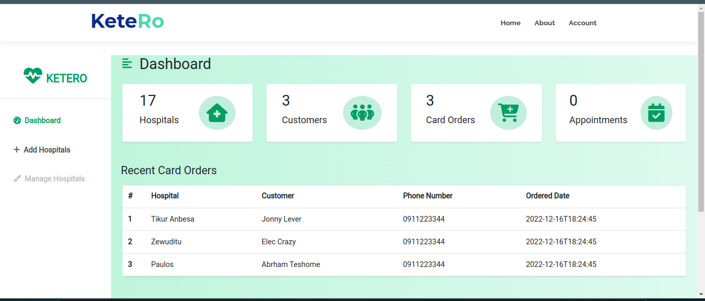

# Ketero (Making an appointment)

## Description

The project is named Ketero - ቀጠሮ - an Amharic word for making an appointment. As the name signifies, Ketero is an online booking web application for booking hospital cards and appointment.
The idea was inspired by the fact that this service does not exist in Ethiopia where we were based and it could help save time, energy and money for patients and hospitals. We aimed that the project would contribute towards digitizing the health care industry.

## Technologies

- Python
- Flask
- SQLAlchemy
- MySQL
- HTML
- CSS
- Bootstrap
- JavaScript
- jQuery
- AJAX
- Jinja
- Google Maps API

## Features

- Users can register and login
- Users can search for hospitals
- Users can book an appointment
- Users can see the nearest hospitals
- Users can see the distance between a hospital and their location
- Users can view their appointment
- Users can view their hospital card
- Users can edit their profile
- Users can see the exact location of a hospital on Google Maps directly from the site
- Admins can add, edit and delete hospitals
- A python console used to directly interact with the database

## Installation

- Clone the repository

```bash
git clone https://github.com/eleccrazy/Ketero.git
```

- Change the directory

```bash
cd Ketero/src
```

- Install the dependencies

  ```bash
  pip install -r requirements.txt
  ```

- Execute the setup_ketero.sql file.

```
mysql -u root -p < setup_ketero.sql
```

- Run the application.

Run the flask application

```
python3 -m front_end.index

```

Run the api.

```
    python3 -m api.v1.app
```

Run the console (Custome python console for interacting with the database)

```
    python3 manage.py
```

## Usage

- Open the browser and go to http://localhost:5000
- To access the API, go to http://localhost:5001

## Screenshots





## Contributors

- [Gizachew Bayness](https://github.com/eleccrazy)
- [Helina Gebreyes](https://github.com/helinaabye)
- [Yoseph Tepano](https://github.com/Jo2831)
